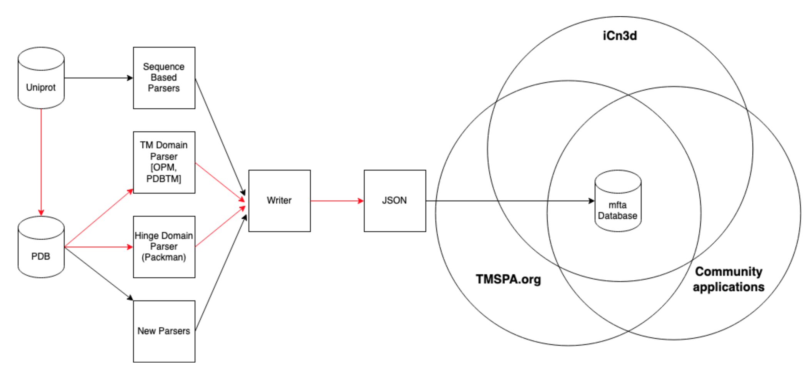

# Sub-domain Annotation of 1TM and 7TM Membrane Proteins

**Team**: Ravi Abrol (Team Lead), David Macoto Ward (Tech Lead),Sayane Shome (Domain Specialist,Logo Designer), and Charlotte Adams (Writer)
## What is the problem?
The currently available information on membrane protein domains is scattered over different platforms and is mainly focussed towards the transmembrane (TM) domains. In order to compare the same domain between proteins or to compare different domains within a protein, a standard is needed.

## The solution:
A web-based searchable database containing membrane fasta (mfta) files enriched with topological features. Through several parsers structural/functional domains are annotated.

## Project goals:
* Add domain parsers(Consensus Transmembrane domains,hinger domains) to incorporate other domains into proteins currently included in the PANDoS database.
* Add domain parsers to incorporate domains for protein families currently not in PANDoS.
* Add sequence homology based domain parsers for proteins with no known structure.
* Create an iCn3D plugin and comparative domain analysis web server at <http://TMspa.org>.

## People/Team
* [Ravi Abrol](http://abrollab.org), California State University, Northridge, USA
* [Charlotte Adams](https://github.com/adamscharlotte), University of Antwerp, Belgium, <charlotte.adams@uantwerpen.be>
* [David Macoto Ward](https://github.com/dmw01),California State University, Northridge, USA
* [Sayane Shome](https://github.com/sayaneshome),Iowa State University,USA
