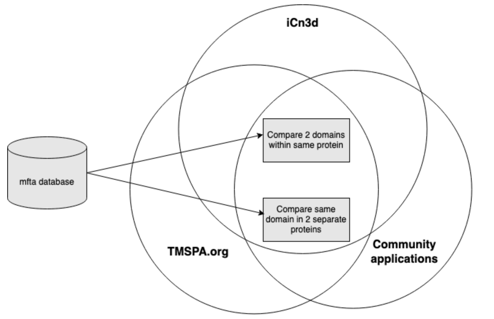

# Sub-domain Annotation of 1TM and 7TM Membrane Proteins

## What is the problem?
The currently available information on membrane protein domains is scattered over different platforms and is mainly focussed towards the transmembrane (TM) domains. 

## Why solve it?
In order to compare the same domain between proteins or to compare different domains within a protein, a standard is needed.

## The Solution
A new mfta format in which the membrane fasta file is enriched with topological features in JSON from iMPEToS. We will define templates for 1TM and 7TM membrane proteins that are used to extract consesnsus domains from OPM and PDBTM. With the new format we will enable searching and comparison of domains.

## People/Team
* Ravi Abrol
* Charlotte Adams
* David Macoto Ward
* Lilia Mesina
* Sayane Shome
